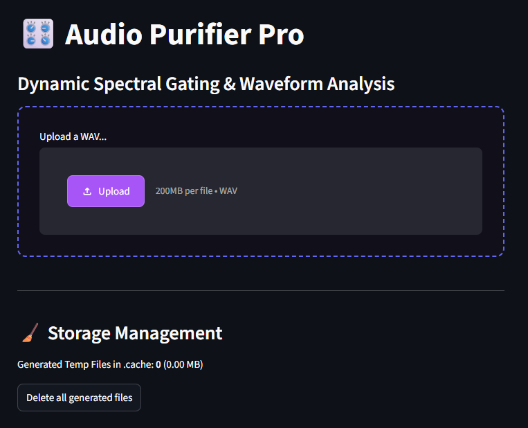
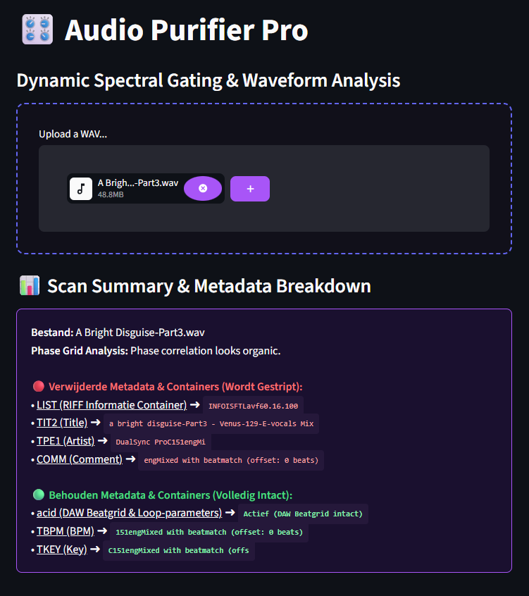
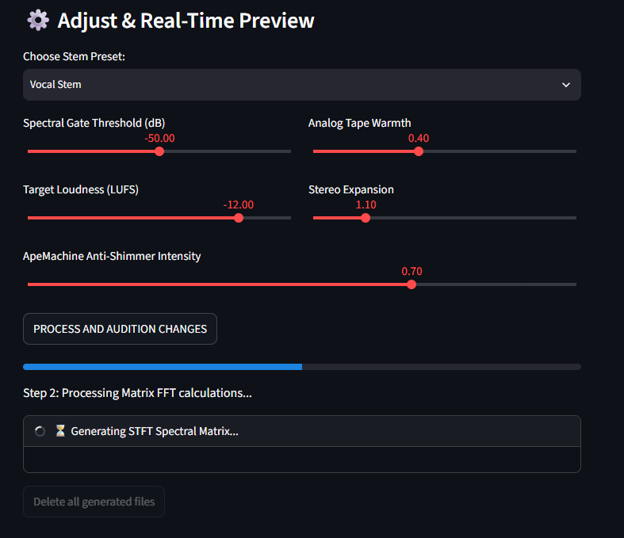
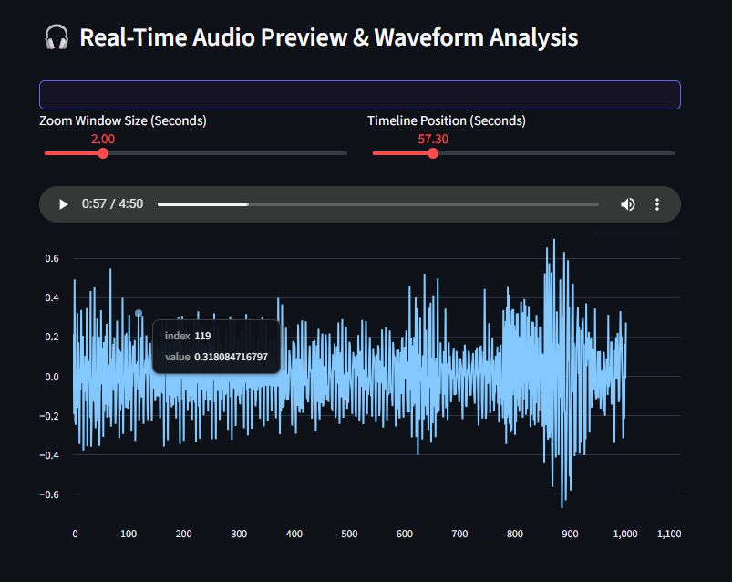

# 🎛️ Audio Purifier Pro

**AI-Free Audio Cleaning with Dynamic Spectral Gating & Waveform Analysis**


Audio Purifier Pro is a powerful Streamlit application for **cleaning audio stems and removing intrusive AI-tracking or distribution metadata** while preserving crucial musical properties—BPM and Key data remain completely intact.


*Figure 1 — The intro screen you see when you first launch Audio Purifier Pro, ready to upload your audio stems.*

---

## ✨ Features

### Audio Analysis & Metadata Inspection
- **Deep Binary Scanning** — analyzes file headers to detect tracking metadata and AI fingerprints
- **Visual Metadata Mapping** — displays which ID3 tags and RIFF chunks are present and which will be targeted for removal
- **Real-time Analysis Logs** — shows detection results before and after purification

### Selective Metadata Purification
- **ID3/RIFF Purification** — automatically strips restrictive tracking headers (`c2pa`, `TC260`) and specific ID3 tags:
  - `TIT2` (Title)
  - `TPE1` (Artist)
  - `COMM` (Comment)
  - Neutralizes AI footprinting without affecting core audio
- **Metadata Retention** — intelligently preserves critical musical elements:
  - `acid` chunks (DAW grid data for sample-accurate timing)
  - `TBPM` (BPM information)
  - `TKEY` (Key/root note)
  - Maintains all essential information for DAW workflows

### Advanced DSP Engine
- **2D Vectorized STFT Matrix Engine** — fast frequency-domain analysis and processing
- **Analog Tape Warmth** — saturation effect for analog character
- **Stereo Field Expansion** — widen or control stereo width
- **ApeMachine Anti-Shimmer Filter** — reduce high-frequency artifacts from processing

### Real-Time Auditioning
- **In-App Audio Player** — listen to original and purified versions side-by-side
- **Waveform Visualization** — downsampled waveform chart with pinpoint zoom capability
- **Precise Timeline Positioning** — scrub through audio for detailed inspection
- **Live DSP Preview** — hear effects as you adjust parameters

### Download & Export
- **Lossless WAV Export** — all processed audio exported as tagged WAV files
- **Metadata Preservation** — ACID chunk and BPM/Key tags embedded in output
- **Batch Processing** — process multiple stems in sequence with unified logging

---

## How It Works

### 1. Upload & Analyze
When you upload an audio stem:
1. **File Detection** — reads file headers (RIFF/ID3 structures)
2. **Metadata Scanning** — deep binary scan identifies all present tags and chunks
3. **Analysis Report** — displays detected metadata with targeting indicators
4. **Real-time Logging** — shows scanning progress and findings


*Figure 2 — The analysis screen showing detected metadata and which items will be targeted.*

### 2. Configure Purification Settings
Before processing, you can:
- **Select Tags to Remove** — choose which ID3 tags to strip (Title, Artist, Comment, or all)
- **Choose DSP Effects** — enable/disable analog warmth, stereo expansion, anti-shimmer filtering
- **Set Effect Parameters** — adjust saturation amount, stereo width, filter strength
- **Preview Effects** — audition your settings on the waveform

### 3. Process & Purify
When you click **"Purify Audio"**:
1. **Binary Injection** — removes selected ID3/RIFF tags while preserving ACID/BPM/KEY chunks
2. **DSP Processing** (if enabled) — applies selected effects in sequence:
   - STFT analysis for frequency-domain processing
   - Saturation / stereo expansion / filtering
   - High-quality reconstruction from STFT
3. **WAV Export** — writes processed audio with embedded metadata (ACID, BPM, KEY preserved)
4. **Real-time Logging** — unified log window shows all processing steps
5. **Progress Indication** — animated progress bar during processing


*Figure 3 — The processing screen with real-time status updates and DSP engine details.*

### 4. Audition & Download
After processing:
- **Side-by-Side Comparison** — toggle between original and purified versions
- **Waveform Zoom** — inspect fine details of the processed audio
- **Timeline Scrubbing** — pinpoint any changes or artifacts
- **Download** — save purified stem as tagged WAV file


*Figure 4 — Real-time waveform preview with full playback and zoom controls.*


*Figure 5 — Processing logs and download section for the purified audio file.*

---

## Architecture

### Frontend (Streamlit)
- **Streamlit 1.28+** — interactive UI for file upload, parameter control, and playback
- **Session State Management** — tracks uploads, processing status, and playback position
- **Waveform Visualization** — matplotlib/Plotly downsampled waveform display with zoom
- **Audio Player** — HTML5 embedded player for real-time auditioning
- **Dynamic Logging** — live text output showing processing steps and results

### Backend (Python DSP Core)
- **Core Audio Engine** — metadata parsing, selective tag removal, and DSP processing
- **API Endpoints (via Streamlit callbacks):**
  - File upload handling
  - Metadata scanning and analysis
  - Selective tag removal (ID3/RIFF surgery)
  - DSP effect chain processing
  - WAV export with metadata retention
  - Download handling

### Audio Processing Core (Python)
- **ID3v2.4 Parsing** — full-featured ID3 tag detection and surgical removal
- **RIFF Chunk Analysis** — identifies ACID, TBPM, TKEY chunks and preserves them
- **SciPy/NumPy STFT** — 2D vectorized frequency-domain analysis for DSP
- **Audio Effects:**
  - Saturation (Tanh soft clipping)
  - Stereo expansion (Mid/Side matrix)
  - Anti-shimmer filtering (Butterworth high-pass)
- **Librosa** — waveform loading and resampling for visualization
- **Soundfile** — high-quality WAV writing with preserved metadata
- **Mutagen** — fallback ID3 tag handling and verification

### File Structure
```
Audio_Purifier_Pro/
├── app.py                  # Streamlit UI & layout
├── core.py                 # DSP engine & metadata handling
├── styles.py               # Custom dark-themed styling
├── requirements.txt        # Python dependencies
├── .gitignore              # Prevents audio files & venv from git
├── .cache/                 # Temporary processed files
├── screenshots/            # UI screenshots
│   ├── intro.png
│   ├── analysis.png
│   ├── processing.png
│   ├── realtime-preview.png
│   └── log-download.png
└── README.MD               # This file
```

---

## Clone, Install & Run

### Prerequisites
- **Python 3.10+** (3.12+ recommended)
- **FFmpeg** (optional, for advanced audio operations)

### Clone the Repository

```bash
git clone https://github.com/laudaniels/Audio_Purifier_Pro.git
cd Audio_Purifier_Pro
```

### Install Python Backend

**Create and activate virtual environment:**

```bash
# macOS/Linux
python3 -m venv .venv
source .venv/bin/activate

# Windows (PowerShell)
python -m venv .venv
.venv\Scripts\Activate.ps1

# Windows (Command Prompt)
python -m venv .venv
.venv\Scripts\activate.bat
```

**Install Python dependencies:**

```bash
pip install -r requirements.txt
```

This installs:
- Streamlit (UI framework)
- SciPy / NumPy (DSP and STFT)
- Librosa (audio loading and analysis)
- Mutagen (ID3 tag handling)
- Soundfile (WAV export)
- Plotly (optional, for advanced visualization)

### Running the Application

```bash
streamlit run app.py
```

Output:
```
You can now view your Streamlit app in your browser.

Local URL: http://localhost:8501
```

Open `http://localhost:8501` in your browser.

---

## Troubleshooting

### Module Not Found Errors
Ensure your virtual environment is activated and all dependencies are installed:
```bash
source .venv/bin/activate  # or .venv\Scripts\activate on Windows
pip install -r requirements.txt --upgrade
```

### Audio File Upload Fails
Supported formats: WAV, MP3, FLAC, OGG
- Check file is not corrupted
- Ensure file size is under 500MB
- Try re-exporting from your DAW if the file seems problematic

### Processing Takes Too Long
This is normal for long audio files (>5 minutes) with DSP effects enabled:
- Disable unused DSP effects (saturation, stereo expansion, anti-shimmer)
- Process shorter stem samples first
- Check CPU usage — close other applications

### Metadata Not Removing Correctly
Some files have non-standard metadata encoding:
- Try uploading the file again
- Check if metadata is read-only in your DAW
- Export a fresh WAV from your source file

### Can't Hear Audio in Browser
- Check browser audio permissions
- Ensure audio is not muted in your OS
- Try a different browser
- Check file is valid WAV (try playing in VLC first)

---

## Basic Workflow

1. **Launch Application** — `streamlit run app.py`
2. **Upload Audio Stem** — drag-and-drop or click upload area
   - Real-time log shows: uploading → analyzing → scanning metadata
   - Metadata report displays detected tags and chunks
3. **Review Detected Metadata** — see which ID3 tags and tracking markers are present
4. **Configure Purification:**
   - Choose which ID3 tags to remove (Title, Artist, Comment)
   - Select optional DSP effects (saturation, stereo expansion, anti-shimmer)
   - Adjust effect parameters
5. **Click "Purify Audio"** — process with real-time logs
   - Real-time log shows: removing tags → applying effects → exporting WAV
   - Progress bar animates until 100%
6. **Audition Results:**
   - Play original vs. purified version
   - Zoom waveform for detailed inspection
   - Scrub timeline to inspect specific sections
7. **Download Purified Stem** — save cleaned audio with preserved BPM/Key metadata

---

## Key Concepts

### Metadata Purification Strategy
- **ID3v2.4 Removal** — surgically removes individual tags while preserving structure
- **RIFF Preservation** — keeps ACID chunks (DAW sample grids) and custom chunks intact
- **Non-Destructive** — original file never modified; purification happens on a copy

### DSP Effect Chain
- **Saturation** — soft-clipping via Tanh function for analog warmth
- **Stereo Expansion** — Mid/Side matrix processing to control stereo image
- **Anti-Shimmer Filter** — high-pass Butterworth filter removes high-frequency artifacts
- All effects use high-quality STFT reconstruction (no aliasing)

### BPM/Key Preservation
- **ACID Chunk** — contains beat grid and tempo (read by FL Studio, Cubase, Logic, Reaper)
- **TBPM Tag** — explicit BPM value in ID3
- **TKEY Tag** — explicit root key in ID3
- All three preserved during purification to maintain DAW compatibility

---

## Output Specification

### Exported WAV Files
All purified stems are lossless WAV with embedded metadata:

**Filename format:**
```
[original-name]-purified.wav
```

**Embedded metadata (preserved):**
- **ACID chunk** — beat grid and tempo (DAW-readable)
- **TBPM** — BPM value (ID3 tag)
- **TKEY** — root key (ID3 tag)

**Removed metadata (stripped):**
- `TIT2` (Title) — if selected
- `TPE1` (Artist) — if selected
- `COMM` (Comment) — if selected
- `c2pa`, `TC260` tracking headers — always removed
- Any non-standard AI fingerprints

---

## System Requirements

- **Processor:** Modern CPU (Intel i5+ or AMD Ryzen 5+) recommended
- **RAM:** 4GB minimum, 8GB recommended
- **Storage:** 5GB free space (for cache and temporary files)
- **Browser:** Chrome, Firefox, Safari, or Edge (for Streamlit UI)

---

## Performance Notes

- **File upload:** near-instant for files <100MB
- **Metadata scanning:** <1 second per file
- **DSP processing:** 1-5 minutes depending on file length and effect complexity
- **WAV export:** real-time (writes while processing completes)

---

## License

MIT License. See [LICENSE](LICENSE) for details.

---

**Last Updated:** 2026-09-16
**Current Branch:** main
